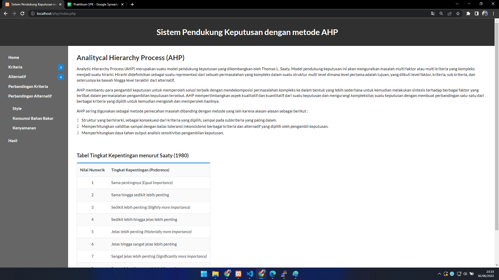
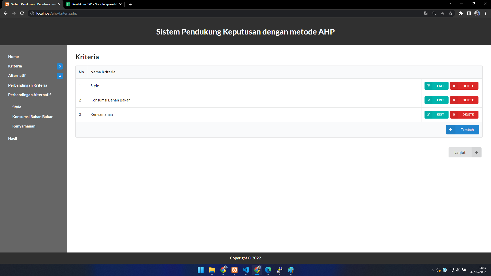
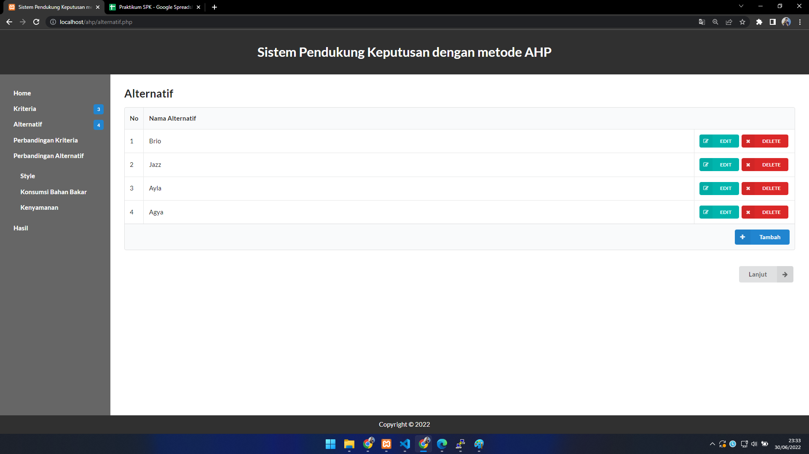
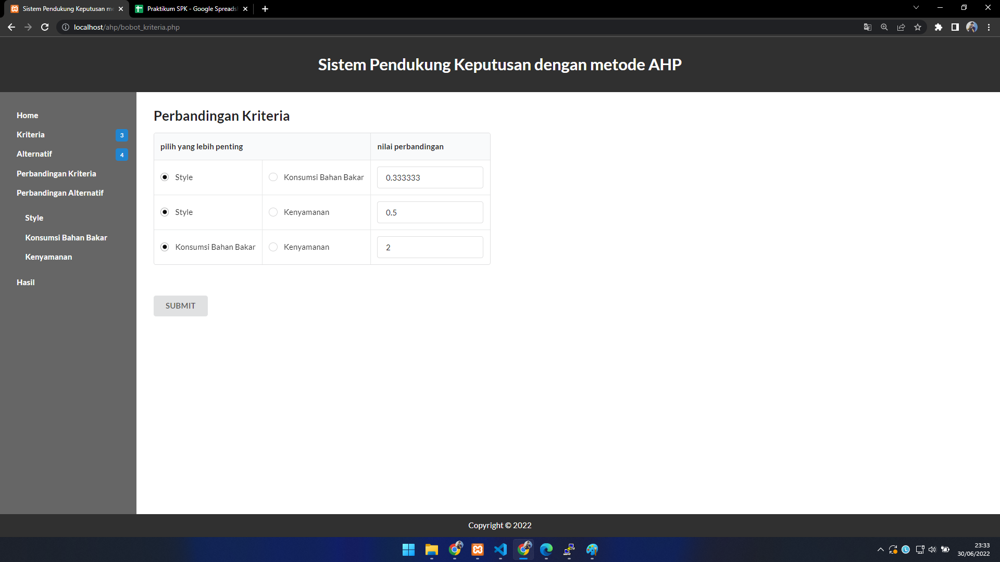
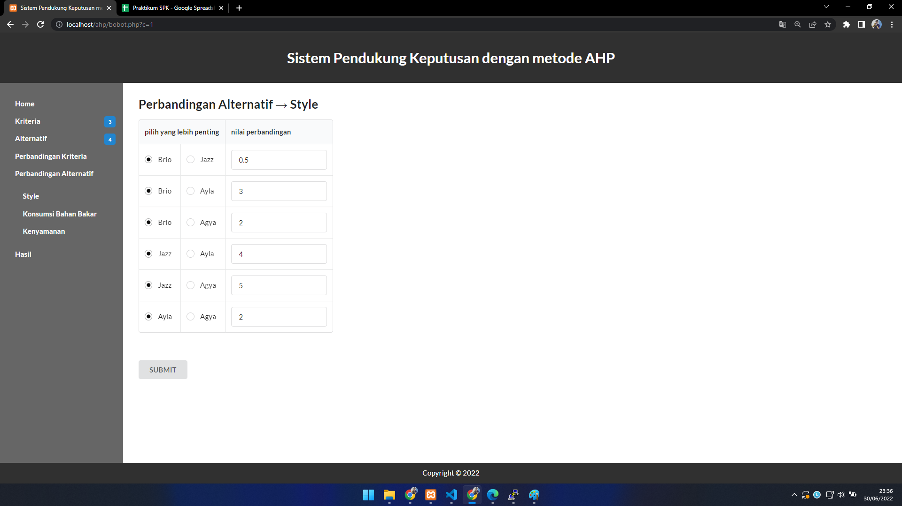
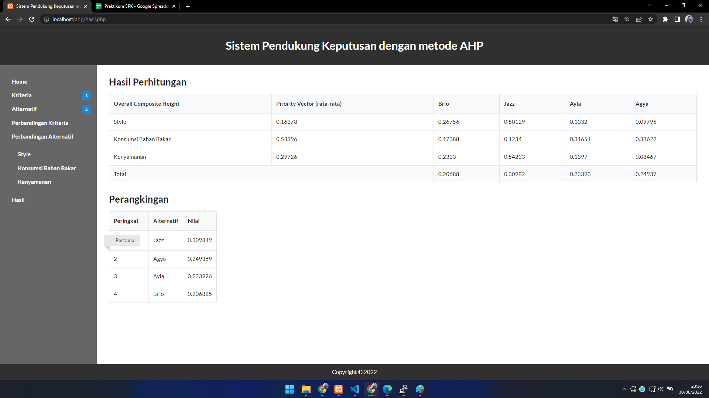
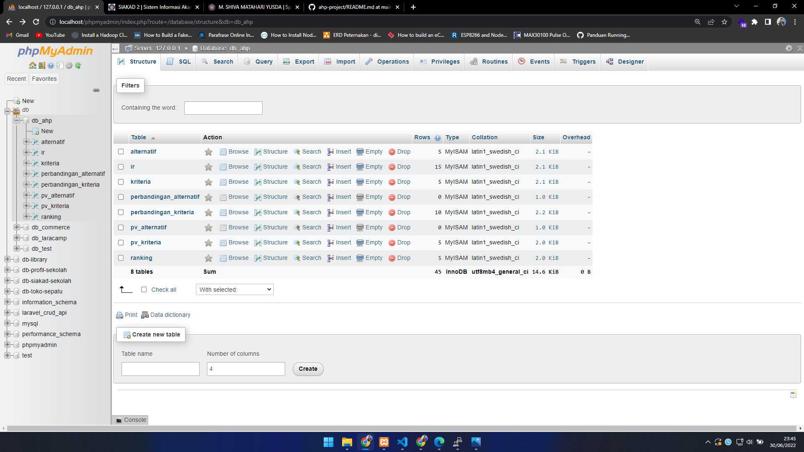

# analytic-hierarchy-process
Decision support system application with AHP method.

## Installation
- create new database in MySQL server (phpMyAdmin)
- edit file config.php
- import database/database.sql into new database
- run website

## Screenshot

1. Halaman Home

2. Halaman Kriteria

3. Halaman Alternatif

4. Halaman Perbandingan Kriteria

5. Halaman Perbandingan Alternatif

6. Halaman Hasil

7. Field Database

